# RisenPC-Fluxbox-ES

MX Linux 23 tiene una versión Fluxbox pero no me gusta como queda, entonces esta es mi versión en español para Ordenadores con pocos recursos

# Requerimientos
Se requiere lo sigiente:

- MX Linux 23 (XFCE) [https://sourceforge.net/projects/mx-linux/files/Old/](https://sourceforge.net/projects/mx-linux/files/Old/)

# Instalación de Fluxbox y dependencias
Con lo siguiente instalaremos las dependencias necesarias:

**Dependencias**

```bash
sudo apt-get install fluxbox lxappearance lxrandr pnmixer numlockx qt5ct \
nitrogen gnome-icon-theme gxkb xfce4-appfinder network-manager-gnome \
pavucontrol
```


# Borre los estilos del paquete de Fluxbox  (Opcional)

El comando anterior instalará fluxbox pero ese trae unos temas muy feos, yo nunca los uso, yo los borro, le recomiendo hacer lo mismo, ponga en la terminal:

```bash
sudo rm -fr /usr/share/fluxbox/styles/
```

No se preocupe aquí usaremos unos

# Borrar los archivos originales de Fluxbox si Ud los usaba

Si usted estaba usando Fluxbox debe haber una carpeta escondida (Si no es este su caso omita este paso) , veala con Ctrl + H

.fluxbox

si esta carpeta usted ya la tenía creada hay que borrarla, puede hacerlo manualmente, o así:

```
sudo rm -fr ~/.fluxbox
```

# Instalar RisenPC Fluxbox Español

Estando en su HOME, kcopie todo de una sola vez  (también si no le funciona en su terminal copie uno por uno):

```bash
    git clone https://github.com/wachin/Risen-PC_Fluxbox_MX_Linux-23-XFCE
    mv Risen-PC_Fluxbox_MX_Linux-23-XFCE ~/.fluxbox
    cd .fluxbox
    mkdir -p ~/.config/pnmixer/
    cp config ~/.config/pnmixer/ && cd && echo "Dios les bendiga"
```
    
**Explicación**  
1er línea.- Clona el repositorio  
2da línea.- Mueve el repositorio entero allí mismo en su HOME cambiandole el nombre a .fluxbox  
3ra línea.- Entra en la carpeta oculta .fluxbox  
4ra línea.-  Crea la carpeta pnmixer (si ya estuviera no)  
5ta línea.- Copia y pega el archivo config de pnmixer que puse dentro de la carpeta .fluxbox que contiene la instrucción "pavucontrol" para que al darle clic y dar clic en elbotón "Mixer" aparezca el control de volumen. **Nota:** También se lo podría Ud poner manualmente así: Clic derecho al icono --> Preferences --> Behavior --> Volume Control Command y allí añadir: "pavucontrol"  

Por cierto, en la terminal quedarán ubicados en .fluxbox pero pueden salir de allí con cd.

# Instalar Menú de aplicaciones con iconos, con xdgmenumaker
El siguiente programa necesario se llama xdgmenumaker, que me gustaría que lo pongan dentro de alguna carpeta aparte, yo estoy usando:

🗀AppsLinux

usted puede crearla manualmente:

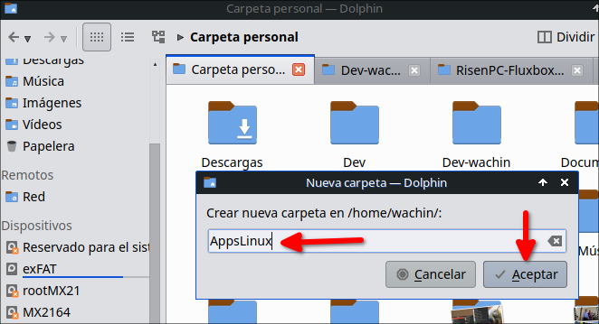

o también lo podría hacerlo desde una terminal con los siguientes comandos:

```
mkdir -p ~/AppsLinux
cd ~/AppsLinux
```

de cualquier manera si lo haga manual o desde la terminal, luego instale los paquetes:

```
sudo apt-get install txt2tags python3-xdg gobject-introspection
```
y luego clone el programa xdgmenumaker y entre en su directorio:

```
git clone https://github.com/gapan/xdgmenumaker && cd xdgmenumaker
```
después haga make:

```
make
```

y hagase super usuario (ponga su contraseña):

```
sudo su 
```
en la siguiente imagen verá usted hasta donde debe usted estar ubicado:

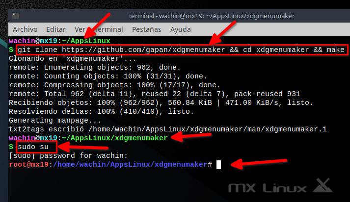

y luego poner lo siguiente:

```
make install && cd .. && exit
```

aquí un captura:

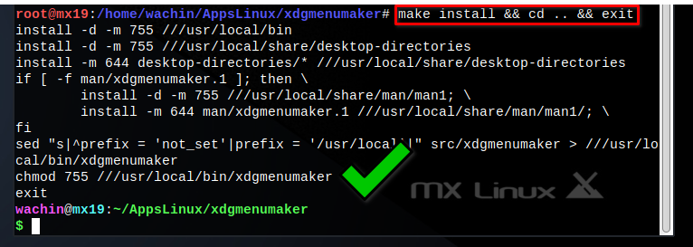

Con esto tendrá iconos de la mayoría de las aplicaciones en el menú de fluxbox

**Nota**: Si lo sedea puede borrar la carpeta xdgmenumaker con:

```bash
sudo rm -fr xdgmenumaker
```

## Creando el Menu de fluxbox, con xdgmenumaker

Ponga en una terminal:

```bash
xdgmenumaker -i -s16 -f fluxbox > ~/.fluxbox/xdg_menu
```

esto es necesario hacerlo sólo una vez

En ese archivo xdg_menu se escribirán todas las aplicaciones que están instaladas en su sistema para que estén disponibles para el menú de Fluxbox 

Para ver el menú de clic derecho en el escritorio o clic derecho en una de las dos esquinas o Super + M quedará así:


## Cierre sesión y vuelva a entrar

Cierre sesión y vuelva a entrar y verá disponible a fluxbox

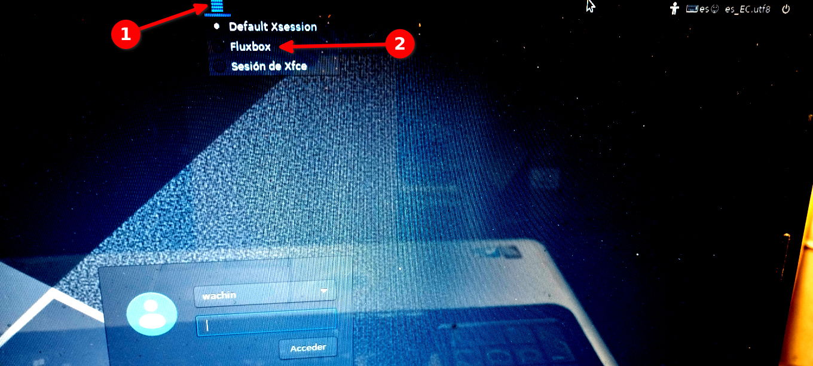

la anterior y la siguiente imagen son de MX Linux 19:

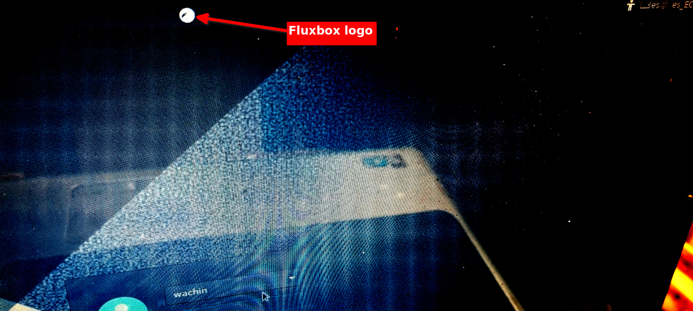


## Actualizar el menú de Fluxbox cada vez que instale alguna aplicación

Esto debe saberlo pues en esta instalación se utiliza a xdgmenumaker pero hay que actualizar el menu después que uno instala alguna aplicación, para hacerlo clic en:

**Actualizar menu de Apps**  

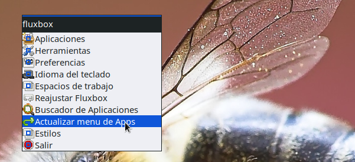

Pero si no desea utilizar este menú sólo use el XFCE4-AppFinder


# Control de volumen
Clic en el control de volumen:  

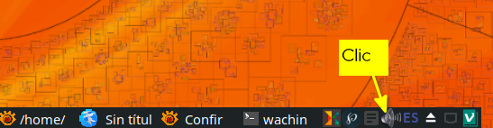

y clic en "Mixer"  

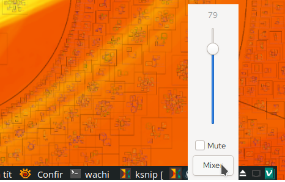

y se abrirá el control de volumen:  

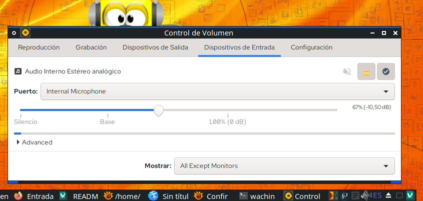


# Temas de iconos para aplicaciones KDE (Qt)

Se configura en:

**Menú --> Herramientas del Sistema --> Ajustes QT5 "Aplicaciones KDE"**

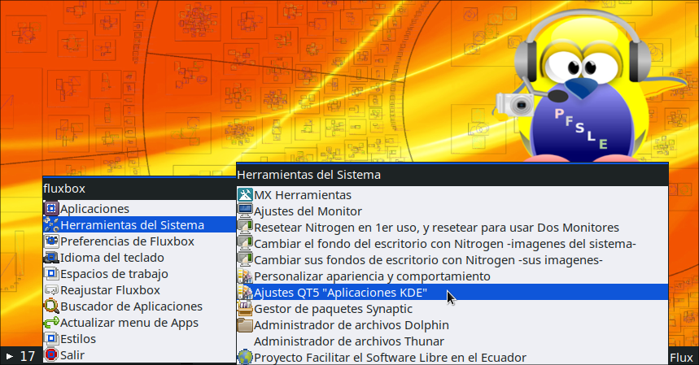

Esto si por un caso desee hacerlo, aunque no lo veo necesario

Si desea cambiar el color de alguna carpeta de dolpin lea:

**Cambiar colores en carpetas de Dolphin (Administrador de archivos) en MX Linux 21, antiX 21 basados en Debian 11 Bullseye, y Ubuntu 22.04 y otros con "Dolphin Folder Color"**  
[https://facilitarelsoftwarelibre.blogspot.com/2022/05/cambiar-colores-en-carpetas-de-dolphin-con-dolphin-folder-color-en-debian-11-ubuntu-22.04.html](https://facilitarelsoftwarelibre.blogspot.com/2022/05/cambiar-colores-en-carpetas-de-dolphin-con-dolphin-folder-color-en-debian-11-ubuntu-22.04.html)  

## El tamaño de las fuentes de las aplicaciones QT

Allí mismo en el configurador QT de clic en la pestaña:

**Tipos de letra**  

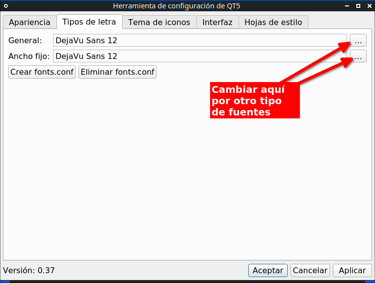

allí arriba como se ve en la imagen cambiar el tamaño de las fuentes:  

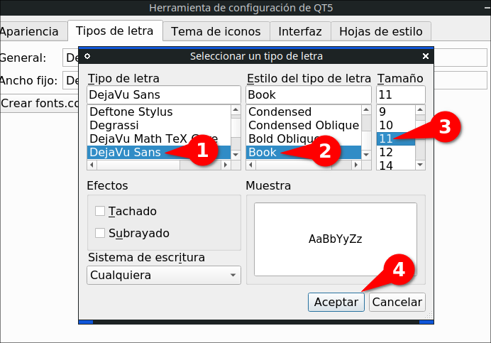

después dar clic en Aplicar luego en Aceptar y cerrar la aplicación escrita en QT ejemplo Kate, Dolphin u otra y vuelvala a abrir y ya tendrán las fuentes otro tamaño, o si cambió la fuente estará usando otra, allí como ve yo le he puesto:

**DejaVu Sans** - **Book** - **11**

pero usted puede elegir otro tipo, estilo, tamaño

como puede ser:  

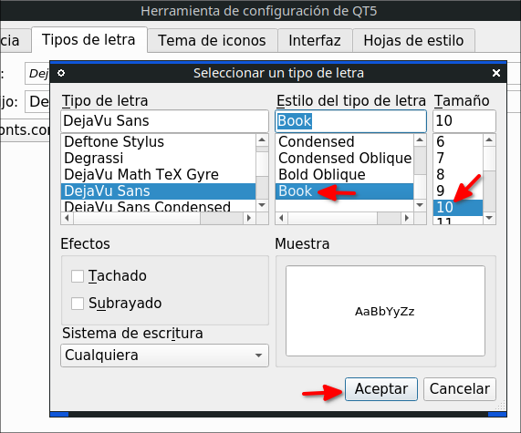

y lo dejo así:  

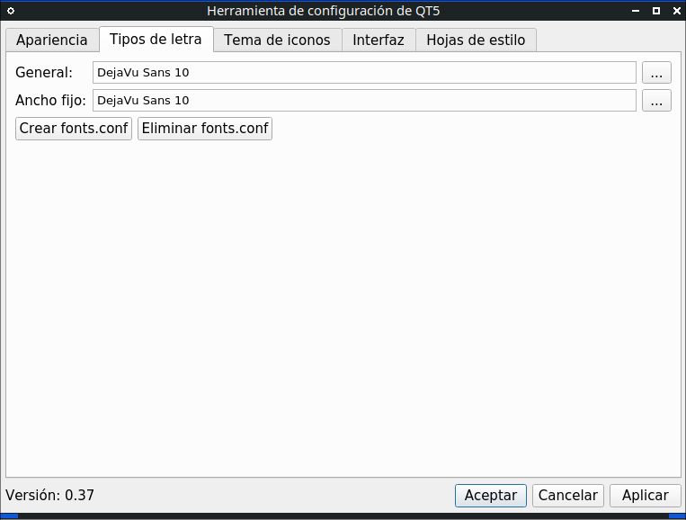

y allí le di clic en Aceptar y Aplicar y reinicié la aplicación Qt que necesitaba.

# Corrección de foco para diálogos Qt/KDE

Fecha: 2026-07-14

En el archivo `~/.fluxbox/apps` añadí una regla `[transient]` para que algunos diálogos de aplicaciones Qt/KDE puedan tomar el foco correctamente:

```text
[transient] (Class=^(kate|kdenlive|dolphin|dmidiplayer|ksnip)$)
  [FocusProtection] {Gain,Lock}
[end]
```

Explicación:

- `[transient]` se aplica a ventanas de diálogo o ventanas modales que usan `WM_TRANSIENT_FOR`.
- `Gain` permite que el nuevo diálogo tome el foco cuando se abre.
- `Lock` evita que otra ventana robe el foco inmediatamente mientras el diálogo modal está activo.

Esta solución es más específica y menos invasiva que cambiar el modelo global de foco para todas las ventanas.

# Atajos de teclado, manual para crear atajos de teclado en Fluxbox

Para crear atajos de teclado personalizados en Fluxbox en Linux, debes modificar el archivo `~/.fluxbox/keys`, que es el archivo de configuración de los atajos de teclado en Fluxbox

## 1. **Ubicación del archivo de configuración de atajos de teclado**
   El archivo de configuración para los atajos de teclado en Fluxbox se encuentra en `~/.fluxbox/keys`. Este archivo se edita con cualquier editor de texto de tu preferencia (por ejemplo, `nano`, `vim`, `gedit`, etc.).

   Para editar el archivo, abre una terminal y ejecuta el siguiente comando:

```bash
nano ~/.fluxbox/keys
```

## 2. **Estructura de los atajos de teclado**
   En el archivo `keys`, cada línea se refiere a un atajo de teclado. Un atajo de teclado tiene tres componentes principales:

   - **Teclas modificadoras**: Las teclas que se usan junto con la tecla de acción, por ejemplo:
  
Ctrl = `Control`
Alt = `Mod1`
Tecla Windows (Super) = `Mod4`

   - **Tecla de acción**: La tecla que se presiona junto con las teclas modificadoras,, son letras como `a`, `k`, `m`, etc.
   - **Comando a ejecutar**: El comando que se ejecutará cuando el atajo de teclado se active. Esto puede ser abrir una aplicación, ejecutar un script, mostrar un menú, etc.

## 3. **Sintaxis para crear un atajo**

La sintaxis básica para un atajo de teclado es:

```
<modificadores> <tecla> :Exec <comando>
```

- `<modificadores>` puede ser una combinación de teclas como `Control`, `Mod1`, `Mod4`, etc.
- `<tecla>` es la tecla que se presiona junto con los modificadores.
- `<comando>` es el comando que deseas ejecutar cuando el atajo sea activado.

   A continuación, algunos ejemplos de atajos de teclado comunes:

   - **Abrir el navegador web**: Para abrir Firefox, el atajo sería:

```
Control Mod1 f :Exec firefox
```

   - **Abrir una terminal**: Para abrir la terminal con el atajo `Ctrl + Alt + T`:

```
Control Mod1 t :Exec xterm
```

   - **Cerrar una ventana**: Para cerrar la ventana activa con el atajo `Ctrl + Alt + C`:

```
Control Mod1 c :Close
```

   - **Alternar entre ventanas**: Para alternar entre las ventanas abiertas, el atajo sería:

     ```
     Mod1 Tab :NextWindow
     ```

   - **Abrir el administrador de archivos**: Para abrir Nautilus (el explorador de archivos) con el atajo `Ctrl + Alt + E`:

```
Control Mod1 e :Exec nautilus
```
** Nota:** Se puede cambiar por: dolphin, nemo, thunar, etc

#### 4. **Reiniciar Fluxbox**
   Después de agregar o modificar los atajos de teclado, es necesario recargar la configuración de Fluxbox para que los cambios surtan efecto. Para hacerlo, puedes ejecutar el siguiente comando:

```bash
fluxbox-remote restart
```

#### 5. **Ejemplo de un archivo de atajos de teclado completo**

Los siguientes atajos en `~/.fluxbox/keys` son unos atajos que estoy utilizando::

```
# Abrir AppFinder con atajo de teclado
# Esto significa que la Tecla Ctrl (Control) y Alt (Mod1) y la tecla A activarán a xfce4-appfinder
# Ctrl + Alt + A lanza xfce4-appfinder
Control Mod1 a :Exec xfce4-appfinder

# Abrir ksnip para capturar un rectángulo con el cursor
# Esto significa que la Tecla Ctrl (Control) y Alt (Mod1) y la tecla K ejecutarán a Ksnip
# Ctrol + Alt + K lanza Ksnip para capturar un rectángulo
Control Mod1 k :Exec ksnip --rectarea

# Abrir el menu de aplicaciones con atajo de teclado (en el lugar donde esté el cursor)
# Esto significa que la tecla de Windows (Mod4) y la tecla M abrirán el menú de las aplicaciones
# Super + M
Mod4 m :RootMenu

# Cómo poner una ventana siempre encima en Fluxbox
# Esto significa que la tecla Alt (Mod1) y la tecla V harán que la ventana que esté primero abiera se quedará allí
# https://linux.byexamples.com/archives/306/makes-your-windows-stay-on-top-toggle-it/
# Alt + V
Mod1 v :ToggleCmd {MacroCmd {RaiseLayer} {RaiseLayer}} {MacroCmd {LowerLayer} {LowerLayer}}

# Minimizar ventana activa
Mod4 n :Minimize

# Mostrar/ocultar escritorio (minimizar todas)
Mod4 d :ShowDesktop
```

### Tabla con mis atajos de teclado

Resumen de mis atajos de teclado:

|  Combinación de teclas  |                  Acción                  |                                   Comando ejecutado                                    |
| ----------------------- | ---------------------------------------- | -------------------------------------------------------------------------------------- |
| **Ctrl + Alt + A**      | Abrir AppFinder                          | `xfce4-appfinder`                                                                      |
| **Ctrl + Alt + K**      | Abrir Ksnip para capturar un rectángulo  | `ksnip --rectarea`                                                                     |
| **Super (Windows) + M** | Abrir el menú de aplicaciones de Fluxbox | `:RootMenu`                                                                            |
| **Alt + V**             | Poner una ventana siempre encima         | `:ToggleCmd {MacroCmd {RaiseLayer} {RaiseLayer}} {MacroCmd {LowerLayer} {LowerLayer}}` |
| **Super (Windows) + N** | Minimizar la ventana activa              | `:Minimize`                                                                            |
| **Super (Windows) + D** | Mostrar/ocultar escritorio               | `:ShowDesktop`                                                                         |

Con estos pasos y ejemplos, puedes agregar más atajos personalizados para cualquier aplicación o acción que desees realizar en Fluxbox.

Antes de que vea la configuración de los atajos de teclado, si usted es curioso y luego quisiera editar los atajos para añadir uno (para usuarios avanzados) puede dar clic derecho en algún lugar del escritorio si estuviera sin ninguna aplicación encima o sino de clic derecho a la izquierda abajo del escritorio:  

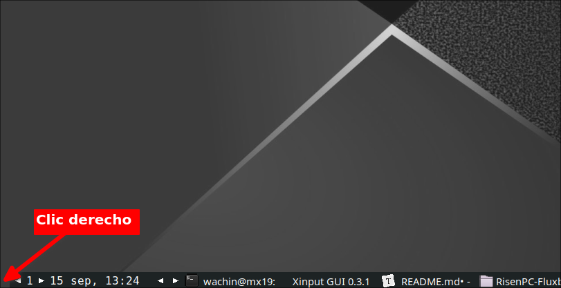

luego clic en:  

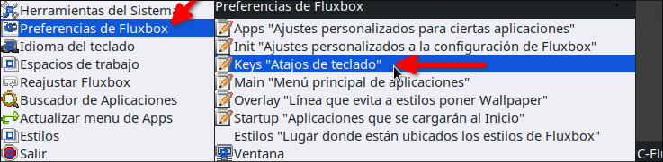

allí yo puse mis configuraciones al archivo .fluxbox/keys  

y a continuación mis atajos con imagenes, y un atajo que ya estaba:

## AppFinder
Para abrir el buscador de aplicaciones AppFinder (xfce4-appfinder)

Tecla Ctrl + Alt + A  

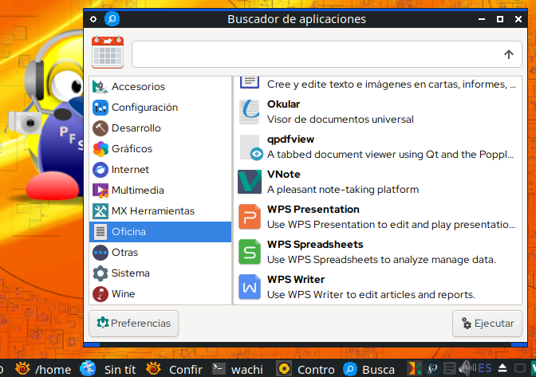


## Abrir menu de aplicaciones
EL siguiente atajo de teclado es para abrir el menu de aplicaciones en cualquier lugar donde esté el cursor, con el atajo de teclado:

Tecla Windows + M

o lo que es lo mismo:

Super + M  

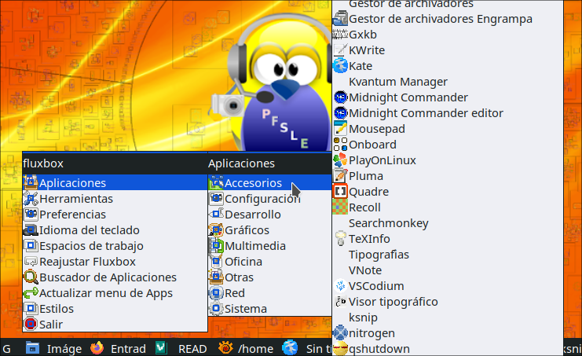

**Nota:** Si no elige ninguna aplicación aplaste ESC para escapar

## Poner una ventana siempre encima
Si usted por ejemplo tiene abierta la terminal y quisiera que ella esté siempre enfrente de las demás ventanas aplaste:

Alt + V

para devolver esa ventana a su estado normal, estando enfrente de la ventana de esa aplicación otra vez dar:

Alt + V

**Nota:** La Tecla Alt se llama Mod1 en las configuraciones de los atajos de teclado de Fluxbox


## Minimizar ventana activa
Con las teclas:

Super + N

se minimiza la ventana activa.

**Nota**: Este atajo está configurado en el archivo `.fluxbox/keys` con:

```
Mod4 n :Minimize
```

## Mostrar/ocultar escritorio
Con las teclas:

Super + D

se muestra u oculta el escritorio con la acción `ShowDesktop` de Fluxbox.

**Nota**: Este atajo está configurado en el archivo `.fluxbox/keys` con:

```
Mod4 d :ShowDesktop
```


# Control de brillo para evitar cansancio ocular

En versiones anteriores usaba Gammy para el control de brillo, pero en el archivo actual `.fluxbox/startup` de este repositorio ya no está añadido al autoinicio. Actualmente allí está añadida esta línea para iniciar `xsct_gui.py`:

```bash
python3 /home/wachin/Dev/xsct_gui-dev/xsct_gui/xsct_gui.py &
```

Si usted no tiene ese programa en esa ruta, puede comentar o borrar esa línea del archivo `.fluxbox/startup`, o cambiarla por la herramienta de brillo que use en su sistema.

Ese archivo lo puede abrir desde el menú:  

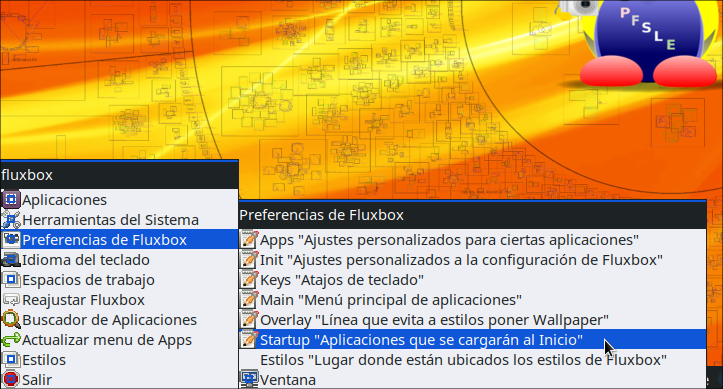

allí lo puse:  

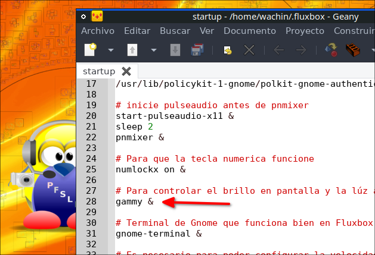

también lo puede buscar manualmente con el administrador de archivos  usando Ctrl + H para ver los archivos ocultos y buscar la ruta:

.fluxbox/startup

lo puede abrir a ese archivo con algún editor de texto, ejemplo en la siguiente imagen con Geany:  

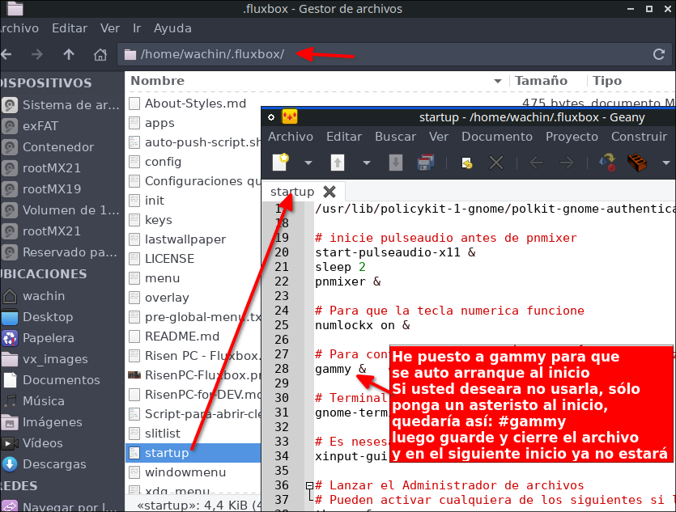

Si decide usar Gammy, puede añadirlo manualmente al archivo `.fluxbox/startup` con una línea como esta:

```bash
gammy &
```

La siguiente imagen es de Gammy en MX Linux 21:

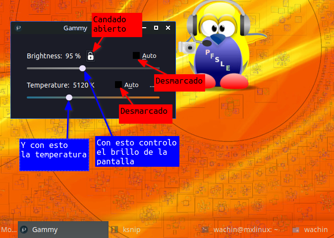


**Para Instalarlo en MX Linux 19.-** hay que compilarlo desde el código fuente, ver:

**Compilando gammy 0.9.51 (herramienta para ajustar el brillo / temperatura del monitor) en MX Linux 19**
<https://facilitarelsoftwarelibre.blogspot.com/2022/02/compilando-gammy-en-mx-linux-19.html>

Por cierto para minimizar gammy en MX Linux 19 es así como muestro en la siguiente imagen:  

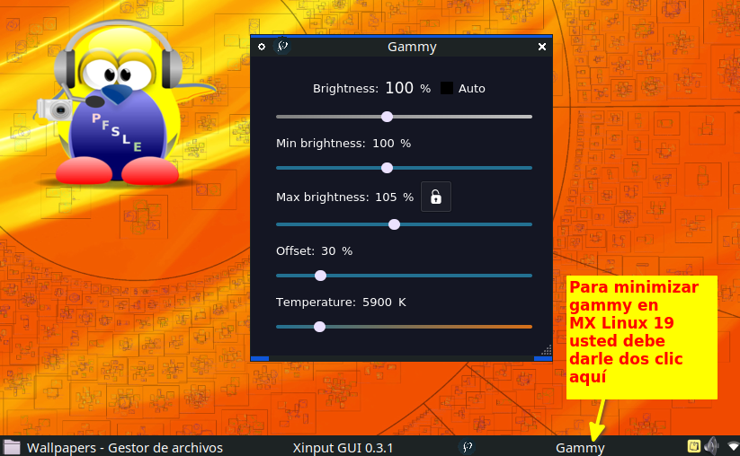


# Cómo cambiar de Estilo de Fluxbox
Cuando usted cambie de estilo:

En es escritorio clic derecho en el menú, o en las esquinas o Super + M y clic en **Estilos**  

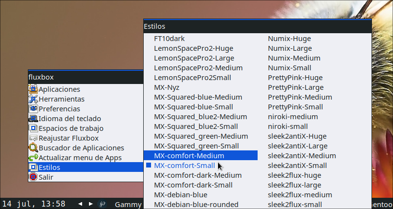

en esta imagen ustedes ven que se ven bien los nombres de los estilos disponibles, sin embargo cuando elijan otro estilo muy posiblemente no se verán bien, para que se vean bien si lo desean pueden cerrar sesión y cuando entren otra vez ya se verán bien las letras, pero esto de cerrar sesión no es necesario de hacerlo del todo, pueden seguir usando Fluxbox y ya en el siguiente ingreso se verá bien.

Por cierto hay algunos de estos temas en lo que al cambiar de tema no se ven todos los estilos disponibles, para arreglar eso de clic:

En es escritorio clic derecho en el menú, o en las esquinas o Super + M y clic en **Reajustar Fluxbox ** 

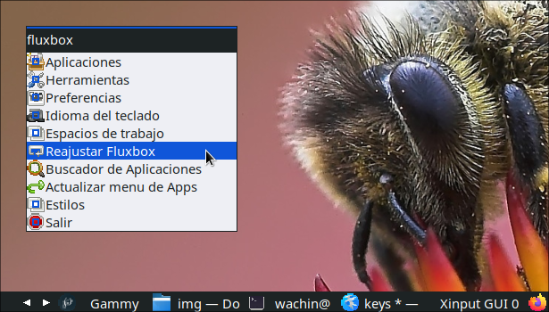

al hacer eso ya se verán bien todos los estilos disponibles


## Sombras en las ventanas con Picom (opcional)

Para que los temas se vean mejor y sea más fácil diferenciar dónde termina cada ventana, se puede usar `picom` para añadir una sombra suave alrededor de las ventanas.

Primero instale `picom`:

```bash
sudo apt install picom
```

Para dejarlo fijo, abra el archivo `~/.fluxbox/startup` y añada esta línea antes de `exec fluxbox`:

```bash
picom --backend xrender --shadow --shadow-radius 17 --shadow-offset-x -17 --shadow-offset-y -17 --shadow-opacity 0.30 --inactive-opacity 1 --active-opacity 1 --frame-opacity 1 --no-fading-openclose &
```

Este comando deja las ventanas con sombras en las cuatro esquinas, sin hacer transparentes las ventanas activas ni inactivas.


# Cambiar el idioma del teclado
Yo vivo en el Ecuador en Latinoamérica y uso la Distribución para Español Latino y por eso lo he dejado configurado para usarlo, cic en:

**Menú --> Preferencias de Fluxbox --> Startup "Aplicaciones que se cargarán al Inicio"**

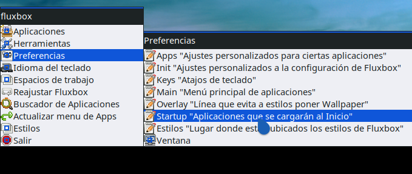

allí en:  

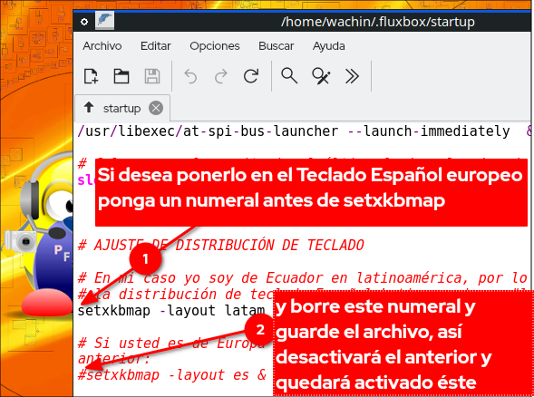

como ve en esa imagen lo puede cambiar por Español España siguiendo esos pasos, así cada vez que usted inicie su ordenador se cargará ese teclado


## Cambiando el idioma del teclado al vuelo (cambio rápido)
Les he dejado un menú para cambiar rápidamente de teclado

En es escritorio clic derecho en el menú, o en las esquinas o Super + M y clic en **Idioma del teclado ** 

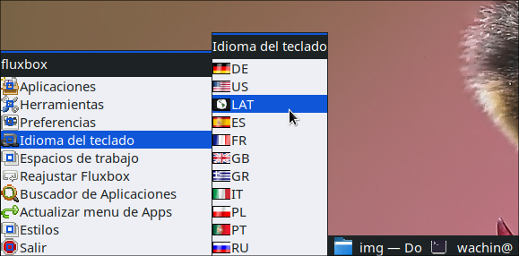

No hay muchos idiomas, pero si ustedes necesiten algún otro me avisan

Esto es util pues imaginese que usted está traduciendo algún documento y quiera cambiar rapido a otro idoma


# Cambiar el wallpaper (Fondo de pantalla)
La primera vez que lo vamos a usar es necesario reiniciar nitrogen, de clic en:

**Menú --> Herramientas del Sistema --> Resetear Nitrogen en 1er uso, y resetear para usar Dos Monitores**

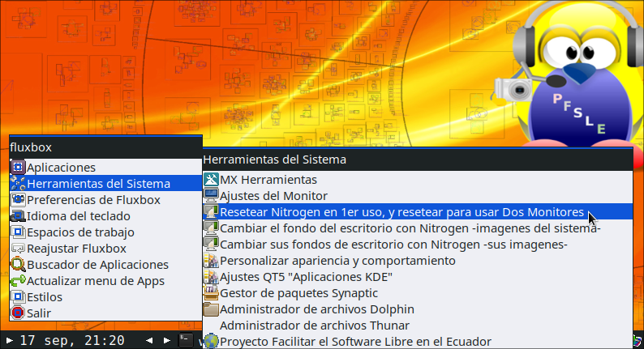

esa opción sirve para dos cosas, lo estamos usando para la primera

después de esto si ya pueden dar clic en:

**Menú --> Herramientas del Sistema --> Cambair el fondo del escritorio con Nitrogen - imagenes del sistema-**

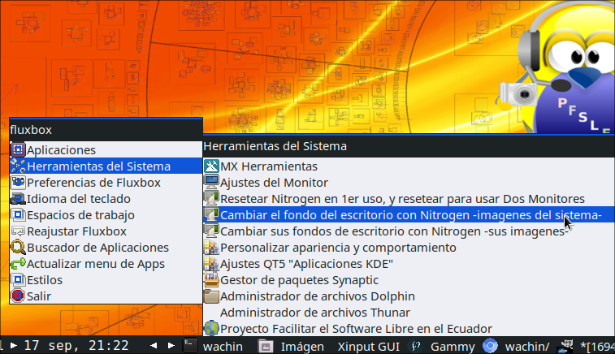

allí se abrirá nitrogen y podrán cambiar de wallpaper, por defecto abrirá los que están instalados en el sistema. En la siguiente imagen le pongo los pasos para elegir otro:  

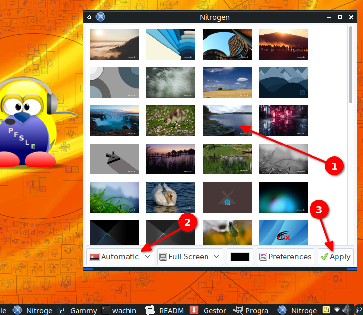

solo que en el punto 2 donde dice **Automatic** cambiele a **Scaled**


# Para añadir un fondo de escritorio (Wallpaper) personalizado

Para usar una imagen como Wallpaper, debe crear una capeta en algún lugar, puede ser dentro de la carpeta Imágenes:  

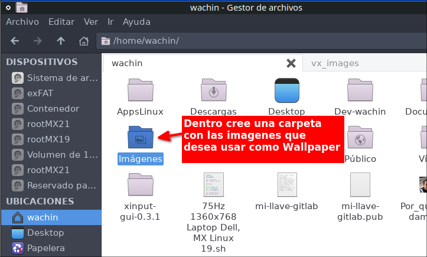

ejemplo:  

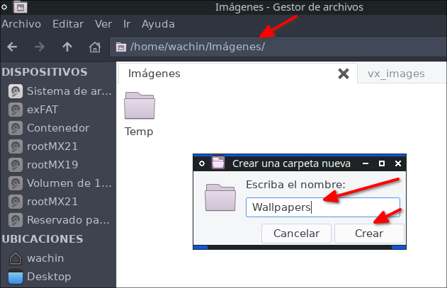

le he puesto como nombre Wallpapers y dentro he puesto varios:  

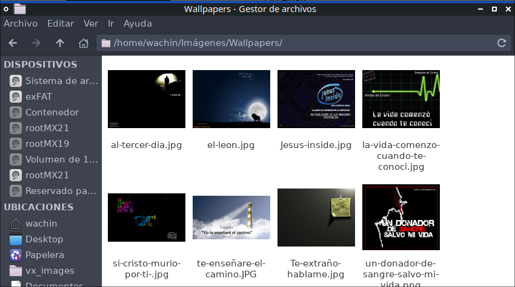

para poder seleccionarlos desde Nitrogen, clic en:

**Menú --> Herramientas del Sistema --> Cambiar sus fondos de escritorio con Nitrogen - sus imagenes-**

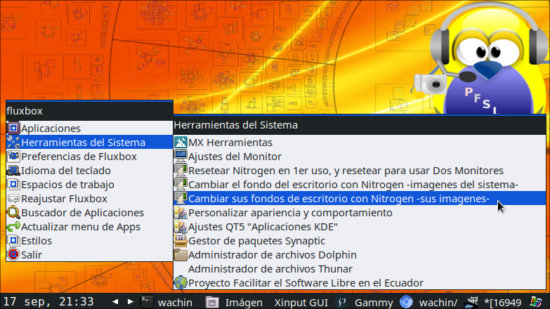

luego debo dar clic en Nitrogen en:

**Preferencias ** 

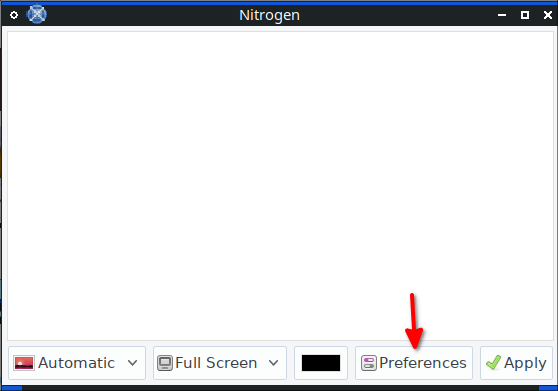

allí añadir la ruta donde están sus Wallpapers:  

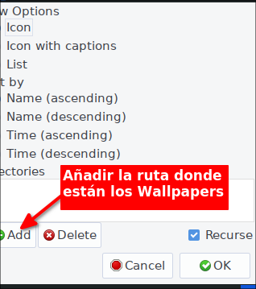

así:  

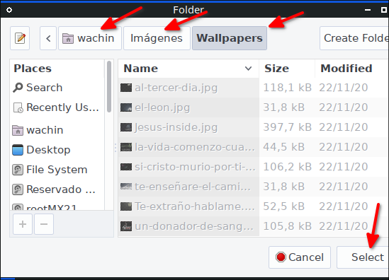

así me queda y doy clic en OK:  

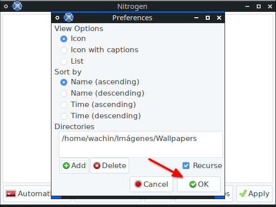

y les pongo la siguiente imagen para que puedan ver Nitrogen ha cargado las imagenes de la carpeta que creé en Imágenes:  

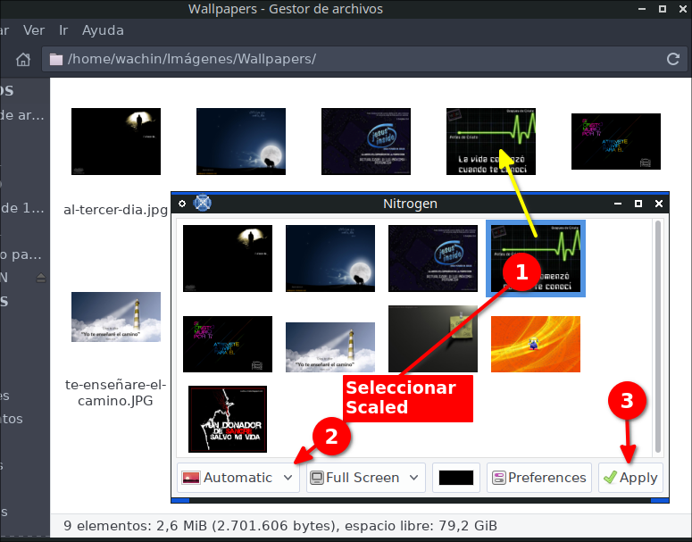

**Nota:** Scaled es para que la imagen ocupe todo el fondo del escritorio si es que no fuera del mismo tamaño y Wallpaper cambiado:  

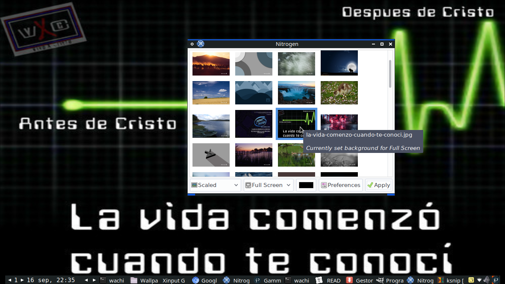


# Para añadir fondos de escritorio (Wallpaper) de los repositorios (de diferentes distribuciones)

En los repositorios hay varios paquetes de fondos de escritorio de diferentes distribuciones, si uno en Synaptic busca la palabra:

**backgrounds**

encontrará varios paquetes que tienen fondos de escritorio  

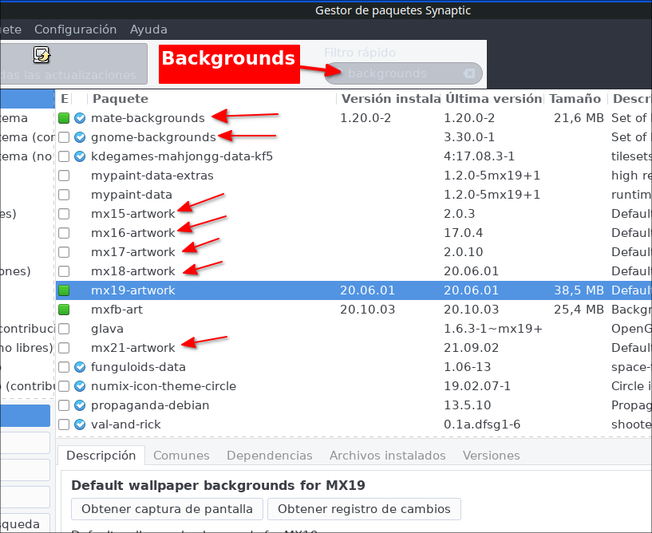

allí como ejemplo instalé:

mate-backgrounds

y si busco en los **Archivos instalados**  

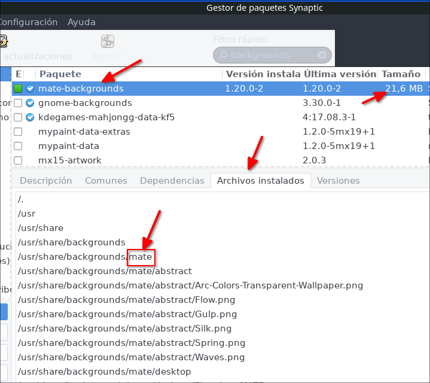

quedan instalados en la siguiente ruta:

/usr/share/backgrounds/mate  

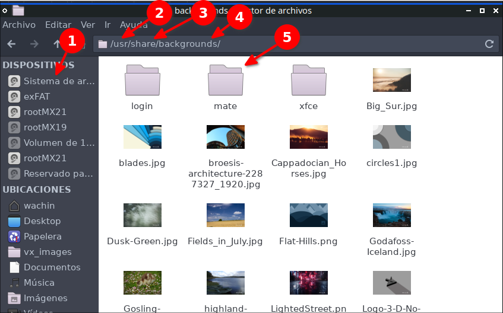

pero Nitrogen no los carga

La solución más fácil para mi es marcarlos para instalar:  

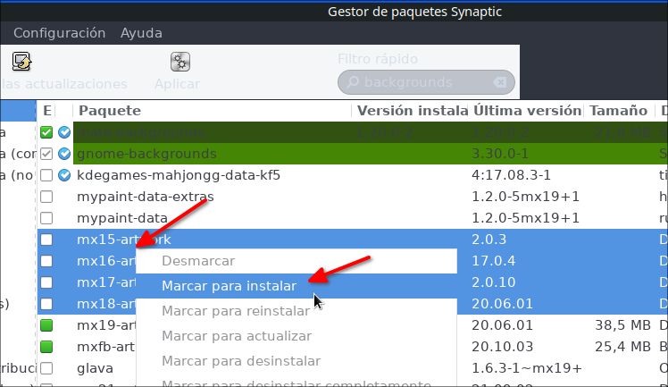

y generar un script de descarga:  

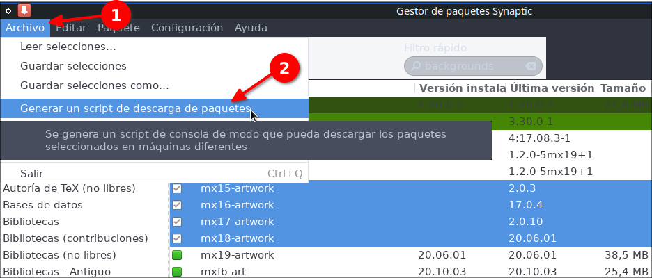

el script de descarga por defecto aparecerá para guardarlo dentro de la ubicación:

root

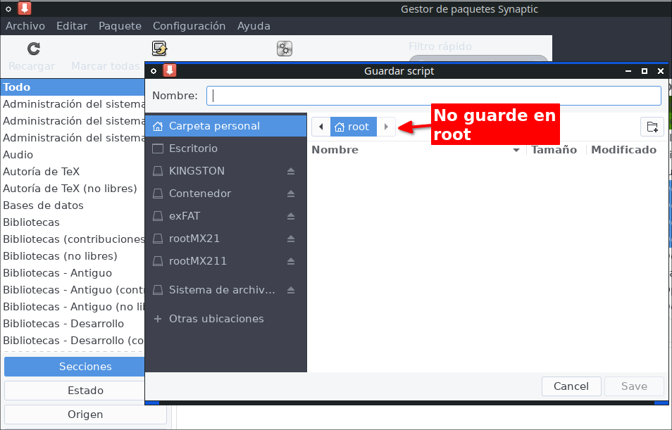

pero yo nunca lo guardo allí (porque después adquieren permisos de super usuario y solo se pueden borrar abriendo un administrador de archivos como root, ejemplo: sudo pcmanfm -pero hay que tener instalado en este ejemplo pcmanfm, u otro administrador de archivos, no recomiendo usar el mismo Thunar por algunas razones-), siempre lo guardo en alguna partición de Windows: NTFS o exFAT, y si usted no tienen ninguna puede poner un Pendrive y guardarlo allí pues generalmente están en formato fat32 o exFAT:

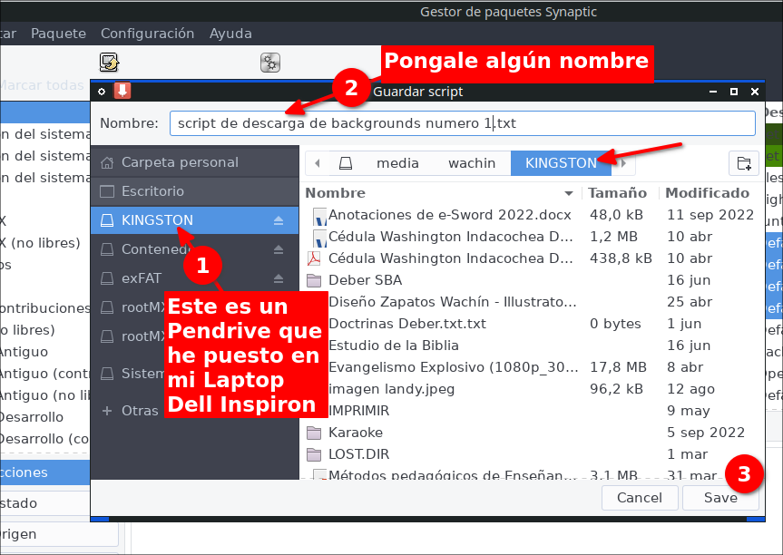

y una vez en el lugar guardado abrir el archivo:

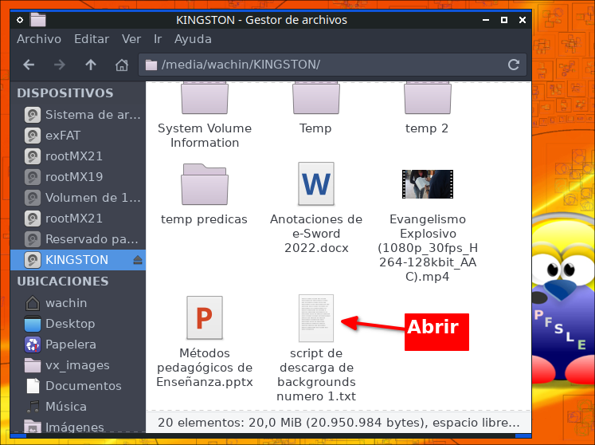

cada una de las lineas generadas en el script:

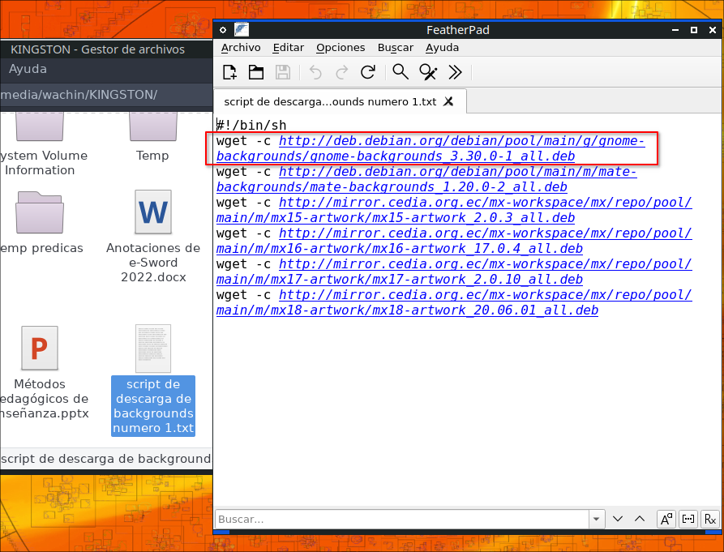

se pueden descargar desde una terminal una por una, o todas al mismo tiempo:


**Nota:** Hay que esperar hasta que el porcentaje esté al 100% de descarga. En la imagen de arriba el **deb** se descargarán en **HOME**

luego a cada paquete lo puede descomprimir con clic derecho extraer aquí:


y dentro buscar las imágenes y moverlas a la carpeta donde usted tiene sus imagenes:


en la siguiente imagen ya he entrado en el lugar donde están todas las imágenes:


todas esas imagenes usted las puede mover al lugar donde tiene sus imagenes para fondos de escritorio

Otros paquete con imagenes para fondo de pantalla:

plasma-wallpapers-addons

**Nota:** Estas imagenes de los paquetes en synaptic buscando las palabras: backgrounds y wallpaper son de MX Linux 19, en MX Linux 21 puede que hayan más paquetes

# Dónde puedo descargar más wallpapers del mundo Linux?

Puede buscar en Google

**Los Wallpapers de Ubuntu:**

Ponga en Google lo siguiente:

backgrounds packages.ubuntu.com/


también con la palabra wallpaper:

wallpaper archive.ubuntu.com


de allí obtuve dos enlaces importantes:

http://archive.ubuntu.com/ubuntu/pool/universe/u/ubuntu-gnome-wallpapers/

http://archive.ubuntu.com/ubuntu/pool/main/u/ubuntu-wallpapers/

también

**Los Wallpapers de Deepin Linux**

wallpapers community-packages.deepin.com/


a la fecha que hago este tutorial encontré este enlace allí:

https://community-packages.deepin.com/deepin/pool/main/d/deepin-wallpapers/

también 

**Los Wallpapers de Linux Mint:**

wallpapers packages.linuxmint.com


# Problemas con abrir terminal en Thunar, solución añadir otra terminal
Si usted usa la opción de abrir la terminal aquí de Thunar pues no lo haga pues la terminal de XFCE (xfce4-terminal) no funciona bien en Fluxbox no se porqué (esto en MX Linux 19 o 21), mejor use Konsole, o gnome-terminal u otra

para hacerlo en el siguiente ejemplo con Konsole (debe ternerla instalada) añada otra terminal así, clic en:

**Editar --> Configurar Acciones personalizadas**


allí clic en el + y llene las siguientes acciones:


con los siguientes datos:

**Nombre:** Abrir Gnome Terminal aquí  
**Descripción:** Iniciar emulador de consola aquí  
**Orden:** gnome-terminal %f  

En icono pongale un icono de terminal, de clic en el botón

**Icono:**

luego clic en y ponga:

**Seleccionar icono de:** Todos los iconos  
**Buscar un icono:** utilities-terminal  

y **aceptar**

y en la pestaña "**Condiciones de aparición**", marcar **Carpetas**:

y **Aceptar**

Ahora si desea puede ubicar más arriba a gnome-terminal, haga así búsque abajo a:

"**Abrir Gnome Terminal aquí**"


y me queda así:


Cuando quiera abrir terminal le aparecerá disponible Gnome Terminal.


## Para añadir la terminal **Konsole**

Debe ternerla instalada:

`sudo apt install konsole`

los datos son así:

**Nombre**: Abrir Konsole aquí  
**Descripción**: Iniciar emulador de consola aquí  
**Orden**: konsole --workdir %f  

y en la pestaña "**Condiciones de aparición**", marcar **Carpetas**

y en **icono** lo mismo de arriba

cuando quiera abrir terminal aquí le aparecerá disponible Konsole


También si desea la puede mover más arriba

**Nota:** Se debería poder añadir otras terminales algo así mismo.

# Temas de iconos recomendados para usar Thunar 
Por defecto será usado el tema de iconos de Gnome que instalamos arriba y se verá el icono en la barra de herramientas, pero si usted desea usar otro como lo es Breeze, ya no se verá el icono de Thunar en la barra de herramientas

Si usted quiere usar otro tema de iconos uno de los que recomiendo es:

Papirus  

para usarlo 

**Menú --> Herramientas del Sistema --> Personalizar apariencia y comportamiento**

**Nota:** El menú principal de Fluxbox se lo puede abrir desde escritorio con clic derecho, o en las esquinas abajo izquierda o derecha abajo, o con el atajo de teclado Super + M


allí en la pestaña:

Tema de iconos


También pueden usar las variantes:

Papirus-Dark  
Papirus-Light  

además el tema:

Numix también debería de funcionar bien. Pueden probar otros si desean

este tema de iconos es además compatible con las aplicaciones KDE si lo usaran también al ponerlo en "Qt5Ct"


# Editar las opciones de Fluxbox (opcional)
Para facil acceso les he dejado 

En es escritorio clic derecho en el menú, o en las esquinas o Super + M y clic en **Preferencias de Fluxbox**


se abrirá el editor de texto que ustedes usen

# Gracias a Note
Este tutorial ha sido hecho gracias al editor de Markdown Multiplataforma VNote:

**Vnote for MX Linux 21 (y Linux basados en Debian 11 Bullseye) ~ Proyecto Facilitar el Software Libre en el Ecuador**
[https://facilitarelsoftwarelibre.blogspot.com/2022/07/vnote-for-mx-linux-deb-package.html](https://facilitarelsoftwarelibre.blogspot.com/2022/07/vnote-for-mx-linux-deb-package.html)

# Configurar la velocidad del cursor en dispositivos 
xinput-gui es una interfaz grafica para xinput que le permitirá editar propiedades de dispositivos como:

- Teclados
- Ratones
- Paneles táctiles
- Touchpad

Así será más rápido y fácil de usar, vea la siguiente entrada para ello:

**No funciona la velocidad del cursor al cambiar o poner un Mouse(o Touchpad) externo en Ubuntu 16.04, 18.04, OpenSUSE, Linux Mint, Debian, antiX, MX Linux, etc - SOLUCIÓN xinput-gui **  
[https://facilitarelsoftwarelibre.blogspot.com/2020/07/no-funciona-la-velocidad-del-cursor-al.html](https://facilitarelsoftwarelibre.blogspot.com/2020/07/no-funciona-la-velocidad-del-cursor-al.html)


Dios les bendiga  


# CONSULTAS: 

Editing_the_init_file  
http://fluxbox-wiki.org/category/howtos/en/Editing_the_init_file.html  

How to place the toolbar to the top in fluxbox? - Unix & Linux Stack Exchange   
https://unix.stackexchange.com/questions/146277/how-to-place-the-toolbar-to-the-top-in-fluxbox  

Fluxbox Documentation  
http://fluxbox.sourceforge.net/docbook/en/html/  

DSL Tips and Tricks :: Changing Fluxbox time display to 24 hour format  
http://www.damnsmalllinux.org/f/topic-3-26-12332-0.html  

IceWM install and setup guide  
http://forums.fedoraforum.org/showthread.php?t=282433  

xdgmenumaker  
https://github.com/gapan/xdgmenumaker  

Nitrogen - ArchWiki  
https://wiki.archlinux.org/title/nitrogen  

Xubuntu Thunar "Open Terminal Here" opens konsole in homefolder  
https://askubuntu.com/questions/891680/xubuntu-thunar-open-terminal-here-opens-konsole-in-homefolder  
https://askubuntu.com/a/892502  https://github.com/mifi/lossless-cut
